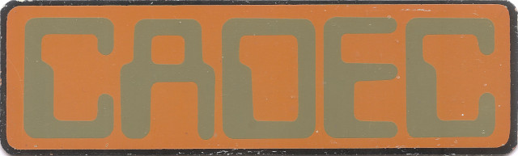
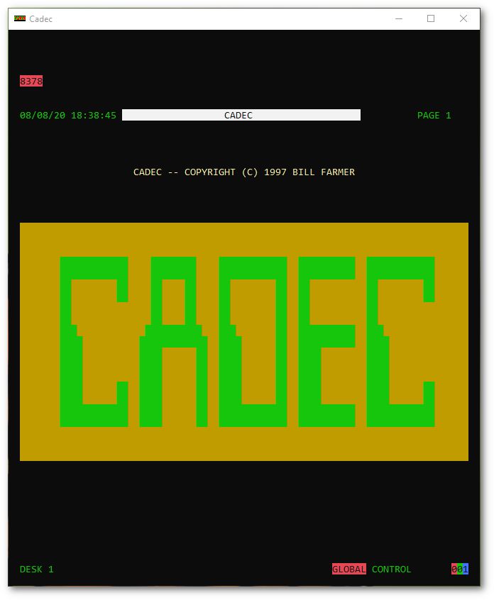
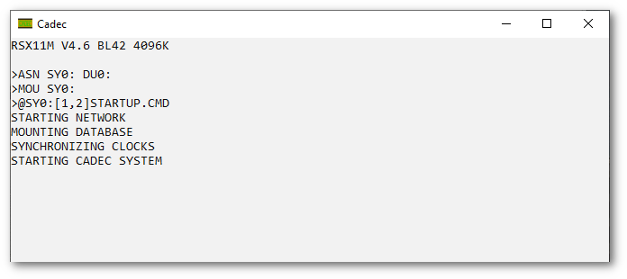

# Cadec
Cadec simulator



Cadec was a telecontrol system built by the Westinghouse Brake and
Signal company in the late 70's for the South Eastern Electricity
Board and installed and commissioned in the early 80's.



The control system was initially based on DEC PDP-11/34 minicomputers
with DEC colour display controllers driving large colour monitors with
bespoke keyboards. It was later upgraded to PDP-11/44 minicomputers
using AYDIN display controllers again driving large colour monitors.

This system existed in use, upgraded to MicroPDP-11/93 microcomputers,
until past the millenium and had to be Y2K upgraded by the development
team.



This simulation is of the display for one control desk for the
upgraded system. It was originally written in Borland Turbo C for a
DOS PC using their conio library. I have added source files to convert
this where possible to run on Windows using the Console API. As the
original code used BIOS and DOS calls to control external devices such
as a ding dong and to determine the presence of a dot matrix printer
for printing logs, this functionality won't work and is not used.

The system is built using MSYS2 using the Makefile provided.

This repository does not contain the original database as this was an
accurate copy of part of the network as it existed.

## Database

The database is a text file which can be edited with any text
editor. Lines beginning with a ‘#’ are ignored by the system. The
format is:

System values: trip probability, successful reclose probability, purple cursor probability and analogue jitter factor
```
VAL	5	75	2	5
```

Substation: spens number and name.
```
SUB	8305	ANGMERING 11
```

Switchgear: make and type.
```
SWG	REY LM23T
```

Tap changer: type.
```
TAP	SINGLE AVE 1
```

Equipment: SPENS, status, analogue 1, analogue 2, name.
```
EQU	00	0000	17	140	ANGMERING
```
The status value is in hexadecimal (base 16) and is made up of 16 bits. These are defined as follows:
```
8  4  2  1 |8  4  2  1 |8  4  2  1 |8  4  2  1  (Hex values)
15|14|13|12|11|10|09|08|07|06|05|04|03|02|01|00
|  |  |  |  |  |  |  |  |  |  |  |  |  |  |  |
|  |  |  |  |  |  |  |  |  |  |  |  |  |  |  Open
|  |  |  |  |  |  |  |  |  |  |  |  |  |  Closed
|  |  |  |  |  |  |  |  |  |  |  |  |  Protection Off
|  |  |  |  |  |  |  |  |  |  |  |  Protection On
|  |  |  |  |  |  |  |  |  |  |  Auto Off
|  |  |  |  |  |  |  |  |  |  Auto On
|  |  |  |  |  |  |  |  |  Tripped
|  |  |  |  |  |  |  |  EFI Indication
|  |  |  |  |  |  |  Protection Operated
|  |  |  |  |  |  Auto Reclose Lockout
|  |  |  |  |  External Indications
|  |  |  |  External Output
|  |  |  Equipment is Trippable
|  |  Equipment has Protection
|  Equipment has Automation
Not Used
```
There are two copies of the database. CADEC.DAT is the backup, and is
read if the work file CADEC.SAV is not found. The database is
automatically saved to CADEC.SAV at 30 second intervals.

### Alarm List

The alarm list is stored in a file called ALARMS.LOG. The format is:
```
875314032	8547	07	A C.B. TRIPPED
```
The fields are: date and time as an integer, substation, equipment and alarm text. 

### Event Log

The event log is stored in a file called EVENTS.LOG. The format is:
```
26/09/97 18:47:12    8547 SOUTH WORTHING 00    SOUTH WORTHING   F PROTECTION OPERATED
```
The fields are: date, time, substation, substation name, equipment,
equipment name and event text. The format of the event text varies wi
th the type of event.

### Automatic Operations

Every second the system checks to see if anything needs tripping. This
is determined by the probability of trip value. If it does the
equipment gets tripped, alarms and events are generated, and if auto
reclose is available and on an auto reclose operation is started. If
sensitive earth fault protection is available and on an EFI alarm will
be generated.

Every second the system checks to see if any auto reclose operations
are pending. If so, it decrements the timer, and performs a trial
reclose when the timer matures. The success of the reclose is
determined by the probability of successful reclose value. Alarms and
events are generated according to the success or failure of the
reclose.

Every second the system increments the keyboard timer and checks to
see if it has run out. If so, the display is changed to the CADEC
logo.

Every 15 seconds the voltage and current analogue values in the
database are jittered. The system keeps a backup copy of the original
value to ensure that analogues do not drift too far. The current
display is refreshed if it is dynamic.

Every 30 seconds the system saves the database to CADEC.SAV.

Every time a command is entered the probability of a purple cursor is
checked and if so, the cursor is turned purple and the system will not
respond to the keyboard until a random timer has timed out.

### Dingdong
Whenever an alarm is generated the system dingdong will initiate. It
will continue to operate at 30 second intervals until a key is
pressed.
